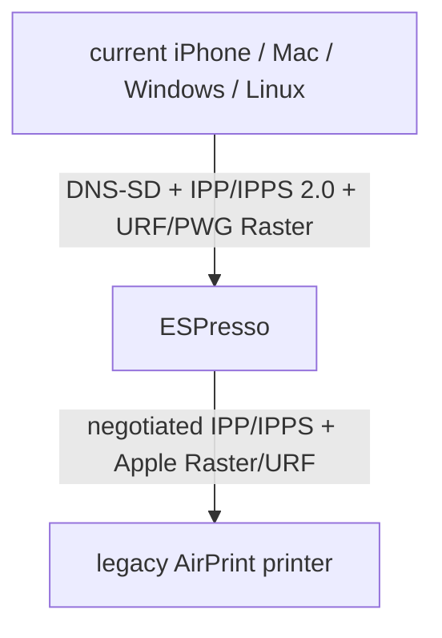

# ESPresso

**Modern AirPrint for printers whose hardware still works.**

[](https://github.com/Krydix/ESPresso/actions/workflows/pages.yml)

ESPresso is an ESP32, ESP32-S2, and ESP32-S3 compatibility proxy for a deliberately narrow printer target:



It does not run CUPS, render PDF, or contain printer drivers. It discovers an existing
AirPrint/IPP printer, republishes its real pass-through formats through current
AirPrint and IPP Everywhere DNS-SD services, translates the IPP envelope, converts
PWG Raster to Apple Raster when necessary, and streams the document to the printer.

> [!WARNING]
> This is alpha firmware. It builds and its protocol codec is host-tested, but it has
> not yet been validated against a physical legacy printer fixture. Do not call it a
> universal print server: capabilities such as JPEG and advanced job operations remain
> conditional on the selected physical printer.

## What is implemented

- ESP32, ESP32-S2, and ESP32-S3 firmware built from one source tree with ESP-IDF 5.4
- first-boot `ESPresso-XXXX` SoftAP and captive portal, with a four-character build identity shared by the firmware and web installer
- post-flash [Improv Serial](https://www.improv-wifi.com/serial/) Wi-Fi provisioning over the same USB/UART connection
- DNS funnel plus DHCP captive-portal URL (Option 114)
- Wi-Fi scan, credential persistence, reconnect, and setup fallback
- `espresso.local` configuration UI
- ESP-native DNS-SD discovery of `_ipp._tcp` and `_ipps._tcp` printers
- CUPS-style active `Get-Printer-Attributes` probing: IPP 2.0 first, then IPP 1.1
- compact persisted capability profile generated from DNS-SD plus IPP
- conservative filtering for printers reporting both `image/urf` and URF modes
- persistent printer selection
- modern AirPrint/IPP Everywhere DNS-SD facade on IPP port 631 and IPPS port 8631,
  with `_universal` and `_print` subtypes
- persistent per-device ECDSA certificate for `espresso.local`, downloadable from
  the management UI; IPPS upstream certificates require CA trust and hostname match
- bounded PWG Raster to Apple Raster conversion with compressed rows forwarded in place
- streaming IPP proxy; the document body is not buffered
- replacement of modern capability requests with a legacy-safe CUPS-style query
- format-specific capability probes for every bounded pass-through PDL, with URF first
- metadata-only synthesis for modern IPP versions, local URIs, bridge UUID and
  endpoint security, while preserving the printer's formats/media/operations
- frontend IPP 2.0 ↔ negotiated legacy IPP version translation
- printer/job URI rewriting in both directions
- explicit safe mediation for Print-Job, Validate-Job, Create-Job/Send-Document,
  Cancel-Job, Get-Jobs and Get-Job-Attributes; unsupported operations and formats
  receive proper IPP status responses
- live printer-state/accepting-jobs refresh from client capability requests
- IPv4 preference with IPv6 fallback and correctly bracketed IPv6 IPP URIs
- `Expect: 100-continue`, bounded receive retries, long streaming-job timeouts and
  strict IPP envelope/content-type validation
- GitHub Actions matrix builds, per-target downloadable artifacts, and one GitHub Pages deployment
- auto-detecting ESP Web Tools manifest generated from each target's own `flasher_args.json`
- dual-slot OTA updates from the settings UI, using either the published GitHub Pages
  app image over verified HTTPS or a streamed custom `.bin` upload

## Install and onboard

**[Open the ESPresso web installer →](https://krydix.github.io/ESPresso/)**

The `main` workflow publishes this browser flasher to GitHub Pages. On a fresh board:

1. Open the [ESPresso web installer](https://krydix.github.io/ESPresso/) in desktop Chrome or Edge and connect an ESP32, ESP32-S2, or ESP32-S3 over USB. The installer detects the chip and selects its matching build automatically.
2. Install ESPresso and wait for the board to restart.
3. Keep USB connected and let the installer send the normal Wi-Fi credentials over
   Improv Serial. It will offer the device's local configuration URL after connecting.
4. Alternatively, join the open `ESPresso-XXXX` Wi-Fi network from a phone or laptop
   (or scan the matching Wi-Fi QR) and use the captive portal to select the network.
5. Open [http://espresso.local](http://espresso.local).
6. Scan for and select the legacy AirPrint printer.

The setup AP remains available as a fallback and closes 15 seconds after ESPresso
joins Wi-Fi through either provisioning path. Configuration remains available at
`espresso.local`.

## Update firmware

Open `http://espresso.local` and use **Firmware Update**. **Download and Install**
pulls the current app image directly from the ESPresso GitHub Pages deployment over
certificate-verified HTTPS. Each chip downloads its own target-specific image.
**Upload and Install** accepts a compatible ESP32 app
binary and streams it to the device without buffering the whole file in memory.

Both methods write the inactive app slot, validate the completed ESP image, switch
the boot slot, and then restart. If the updated app cannot complete its startup
checks, the bootloader rolls back to the previous slot. NVS-backed Wi-Fi and printer
settings are preserved.
The maximum custom image size is shown by the device API and is currently 1,900,544
bytes.

> [!IMPORTANT]
> Builds installed before dual-slot OTA support used a factory-only partition table.
> Those boards need one USB installation from the web installer to adopt the OTA
> partition map. Future app updates can then be installed over Wi-Fi.

## Build locally

Install ESP-IDF 5.4, then:

```sh
make test
make test-raster
make test-ipps
make test-cups
make test-compat
make test-sanitize
make test-fuzz-smoke
make test-roadmap
make test-conformance-report
make build
make web-installer
make flash PORT=/dev/cu.usbmodemXXXX
```

The default firmware target is `esp32s3`. Select another supported chip with
`TARGET=esp32` or `TARGET=esp32s2`, for example `make build TARGET=esp32`.
After building all three targets, `make web-installer-all` combines them into one
installer manifest. The browser identifies the connected chip; no board selector is
required.

`test-cups` uses the system `ipptool` as an independent parser/oracle. `test-compat`
adds a stateful host-native legacy-printer emulator around the same codec and relay
policy used by the firmware, then runs CUPS semantic comparisons, RFC edge cases,
multi-step job flows, exact 1 MiB document relays, IPP/1.1 fallback, chunked legacy
responses, legacy attribute aliases, DNS-SD recovery, and malformed-response
rejection. `test-fuzz-smoke` runs a sanitizer-coverage-guided bounded IPP/profile
fuzzer. `test-conformance-report` requires the complete CUPS IPP/1.1 and IPP/2.0
suites to pass. It also requires IPP Everywhere to pass against the truthful
conformance fixture whose upstream supplies mandatory JPEG and advanced operations;
ESPresso supplies PWG Raster conversion and facade metadata.
`test-roadmap` validates [the feature matrix](tests/feature-matrix.json) and executes
its automated capability probes, failing when an outcome changes without the matrix
being updated.
See [docs/compatibility-lab.md](docs/compatibility-lab.md). `IDF_PATH`
defaults to `~/esp/esp-idf` and can be overridden on the command line.

## Architecture

```text
main/
  wifi_manager.c        station reconnect + captive-portal SoftAP
  dns_server.c          setup-only wildcard DNS responder
  web_server.c          embedded setup/config UI and JSON API
  ota_update.c          streamed upload + certificate-verified GitHub Pages OTA
  printer_discovery.c   legacy printer discovery + AirPrint advertisement
  printer_advertisement.c host-tested AirPrint DNS-SD TXT policy
  printer_capabilities.c CUPS-style active IPP probing with 1.1 fallback
  printer_identity.c    stable bridge identity distinct from the old printer
  printer_transport.c   tested IPP/IPPS endpoint and certificate policy
  ipp_proxy.c           bounded IPP envelope buffering + document streaming
  ipp_proxy_core.c      host-tested production request relay policy
  ipp_stream.c          bounded, short-I/O-safe document pump
  ipp_codec.c           allocation-bounded IPP attribute/URI transformation
  raster_converter.c    bounded compressed PWG Raster → Apple Raster conversion
  tls_identity.c        persistent device certificate + IPPS server sessions
  app_state.c           synchronized runtime state + NVS printer profile

frontend/index.html     UI embedded into firmware
web-installer/          GitHub Pages source
scripts/                ESP-IDF flash-map → ESP Web Tools staging
tests/                  host codec tests + live CUPS ipptool oracle fixture
  compat/               differential CUPS compatibility lab + printer fixtures
  roadmap/              executable green/expected-red feature probes
```

The request path buffers only the IPP attribute prefix (maximum 64 KiB), rewrites it,
then relays the remaining print document in 4 KiB chunks. Responses and discovery
queries are capped at 128 KiB because capability and job responses contain attributes
rather than documents.

The embedded CUPS subset is intentionally semantic rather than a libcups port. ESP-IDF
provides the mDNS and HTTP transports. CUPS/PWG behavior supplies the discovery order,
capability query fallback, normalized profile, and outward DNS-SD/IPP mappings. See
[docs/embedded-cups-subset.md](docs/embedded-cups-subset.md) for the exact boundary.

## Current compatibility boundary

The selected target must:

- be reachable over IPP or certificate-valid IPPS on the same IPv4 or IPv6 LAN;
- advertise `_ipp._tcp` or `_ipps._tcp` through Bonjour/mDNS;
- accept Apple Raster (`image/urf`); and
- accept pass-through formats that ESPresso advertises other than PWG Raster.

Any format in the selected printer's `document-format-supported` value can be relayed
unchanged, but Apple Raster remains mandatory for this first target.

PWG Raster is advertised only for a URF-capable target and is converted while its
compressed rows stream through bounded memory. IPP Everywhere conformance is conditional:
for example, a color target must itself accept JPEG, and advanced job operations and
overrides are advertised only when the target reports them.

Not implemented: PDF/JPEG rendering, USB printers,
PCL/PostScript drivers, PPD processing, filters, subscriptions implemented by ESPresso,
spooling, or a signed compatibility database. ESPresso can derive basic
media-size collections from PWG self-describing names, but margins, sources, finishings,
and live printer/job state remain the old printer's responsibility.

Incoming IPP requests may use either `Content-Length` or chunked transfer encoding.
Because ESP-IDF's standard HTTP server rejects chunked request bodies, port 631 uses a
small bounded socket parser and re-chunks document jobs toward the legacy printer.
Document data remains streamed in 4 KiB pieces and can be much larger than RAM. A
legacy endpoint that rejects chunked uploads would require spooling and is not supported.
This is a known edge case in non-conforming embedded HTTP implementations, even though
IPP/1.1 has required servers to accept chunked requests since 2000. It can be diagnosed
without printing by running the same harmless `Get-Printer-Attributes` request through
`ipptool -C` and `ipptool -L`; success with `-L` but failure with `-C` identifies the
incompatibility. See [the compatibility boundary](docs/embedded-cups-subset.md#upstream-chunking-edge-case).

## Design references

The Pages build/deploy shape is adapted from
[Krydix/DDC-Matter](https://github.com/Krydix/DDC-Matter). The onboarding flow follows
Espressif's [ESP-IDF captive portal example](https://github.com/espressif/esp-idf/tree/master/examples/protocols/http_server/captive_portal),
including the DNS funnel and standards-based DHCP captive-portal hint. Discovery uses
Espressif's [mDNS component](https://github.com/espressif/esp-protocols/tree/master/components/mdns).

The lightweight compatibility behavior is derived from the
[CUPS DNS-SD backend](https://github.com/OpenPrinting/cups/blob/master/backend/dnssd.c),
[CUPS capability fallback](https://github.com/OpenPrinting/cups/blob/master/scheduler/ipp.c),
[CUPS DNS-SD advertisement builder](https://github.com/OpenPrinting/cups/blob/master/scheduler/dirsvc.c),
and [PWG sample IPP server](https://github.com/istopwg/ippsample/blob/master/server/printer.c).
It still needs validation against captured physical-printer fixtures and `ipptool`.
